# 7-segment-display
4-variable Karnaugh Map minimized logic implemented in Logisim

## 🔢 7-Segment Display Truth Table (Hex 0–F, Active-HIGH)

| Hex | a | b | c | d | e | f | g |
|-----|---|---|---|---|---|---|---|
| 0   | 1 | 1 | 1 | 1 | 1 | 1 | 0 |
| 1   | 0 | 1 | 1 | 0 | 0 | 0 | 0 |
| 2   | 1 | 1 | 0 | 1 | 1 | 0 | 1 |
| 3   | 1 | 1 | 1 | 1 | 0 | 0 | 1 |
| 4   | 0 | 1 | 1 | 0 | 0 | 1 | 1 |
| 5   | 1 | 0 | 1 | 1 | 0 | 1 | 1 |
| 6   | 1 | 0 | 1 | 1 | 1 | 1 | 1 |
| 7   | 1 | 1 | 1 | 0 | 0 | 0 | 0 |
| 8   | 1 | 1 | 1 | 1 | 1 | 1 | 1 |
| 9   | 1 | 1 | 1 | 1 | 0 | 1 | 1 |
| A   | 1 | 1 | 1 | 0 | 1 | 1 | 1 |
| B   | 0 | 0 | 1 | 1 | 1 | 1 | 1 |
| C   | 1 | 0 | 0 | 1 | 1 | 1 | 0 |
| D   | 0 | 1 | 1 | 1 | 1 | 0 | 1 |
| E   | 1 | 0 | 0 | 1 | 1 | 1 | 1 |
| F   | 1 | 0 | 0 | 0 | 1 | 1 | 1 |

## 🖼️ Segment Examples (0 → F)

| Hex | Preview | Hex | Preview |
|-----|---------|-----|---------|
| 0   | 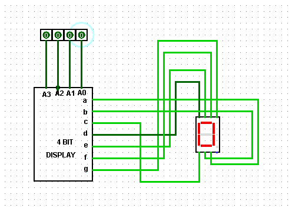 | 8  | 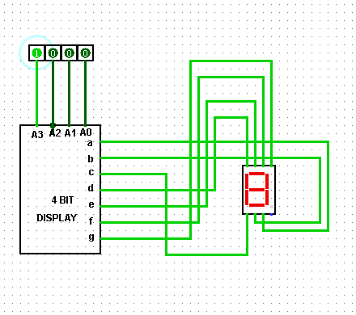 |
| 1   | 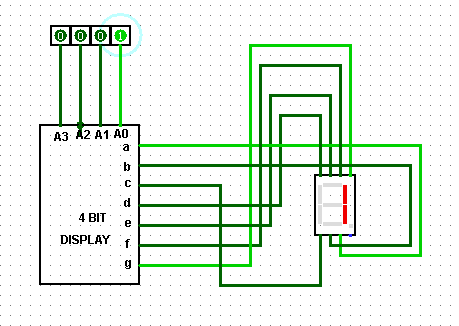 | 9  | 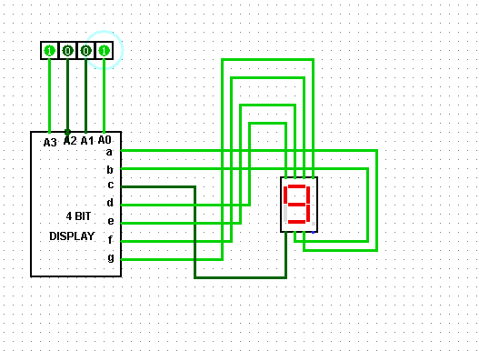 |
| 2   | 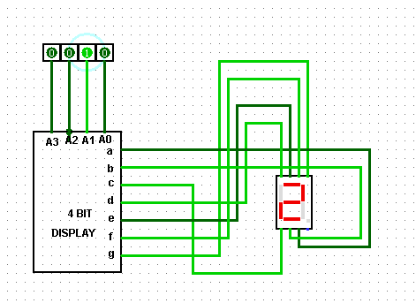 | A  | 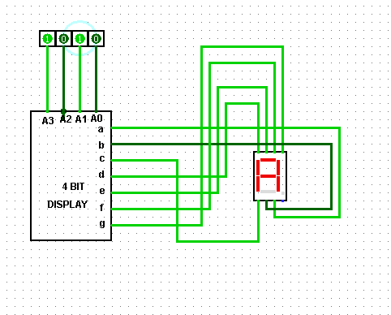 |
| 3   | 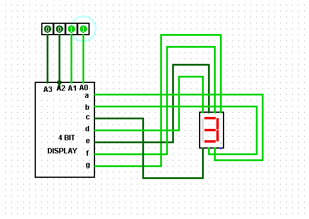 | B  | 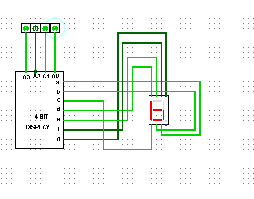 |
| 4   | 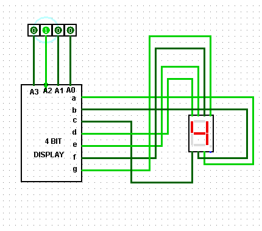 | C  | 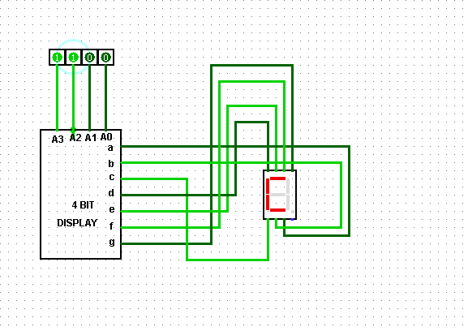 |
| 5   | 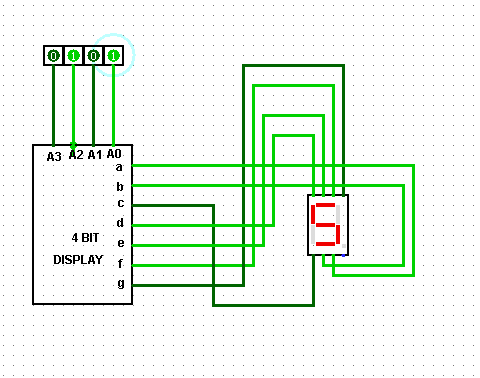 | D  | 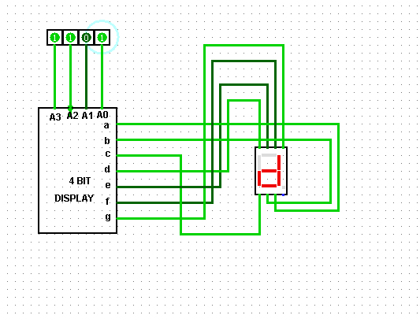 |
| 6   | 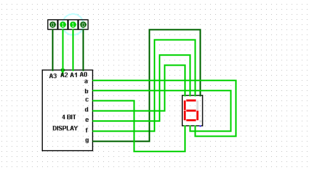 | E  | 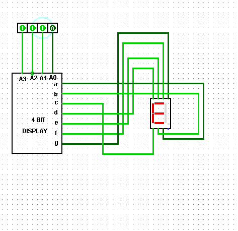 |
| 7   | 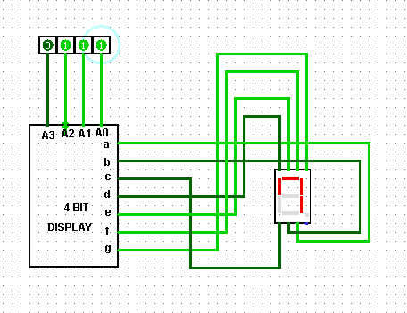 | F  | 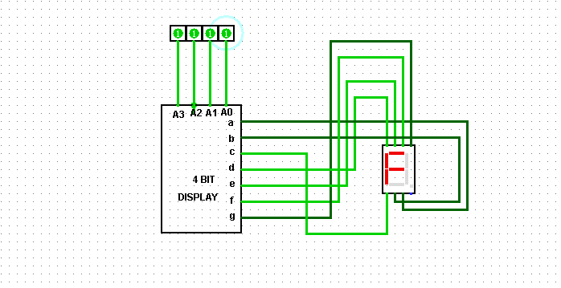 |
